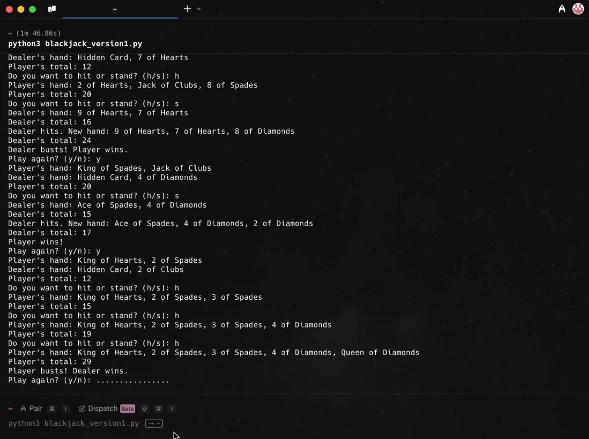

# DevMind — Penn AI Hackathon 2025 Finalist

## The problem

Developers lose hours every day context-switching — jumping between docs, stack traces, and codebases trying to understand what a piece of code actually does. The problem isn't intelligence, it's tooling that doesn't understand your code the way you do.

## What I built

An AI-powered developer tool built in 48 hours at Penn AI Hackathon 2025, earning Finalist recognition among 50+ teams.

- Developed backend processing pipelines using static code analysis and LLM APIs to analyze code structure and generate contextual insights
- Processed and structured code datasets to support LLM-based analysis
- Built and demoed a functional MVP end-to-end within the hackathon window

## How it works

The core pipeline: static analysis extracts code structure (function signatures, call graphs, dependencies) → structured representation fed into LLM prompt with targeted context → model returns developer-facing insights on logic, potential bugs, and improvement suggestions.

Key decision: rather than feeding raw code directly to the LLM, we pre-processed it into structured summaries first. This reduced token usage, improved response relevance, and made the system faster on large files.

## What I learned

Prompt engineering is systems design. How you structure the input to an LLM determines the quality of the output far more than which model you use.

Building under a 48-hour constraint forces ruthless prioritization — we cut three features to make sure the core pipeline actually worked end-to-end before the demo.

## Screenshots

---

**Tech:** Python · LLM APIs · Static Code Analysis · React
